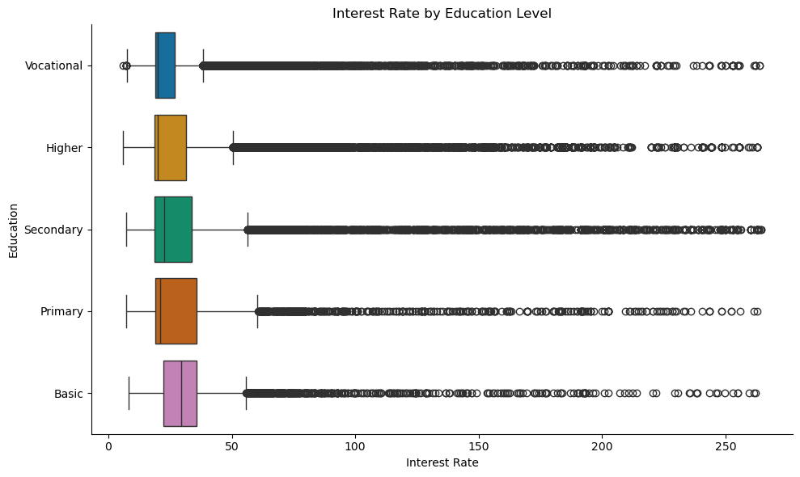
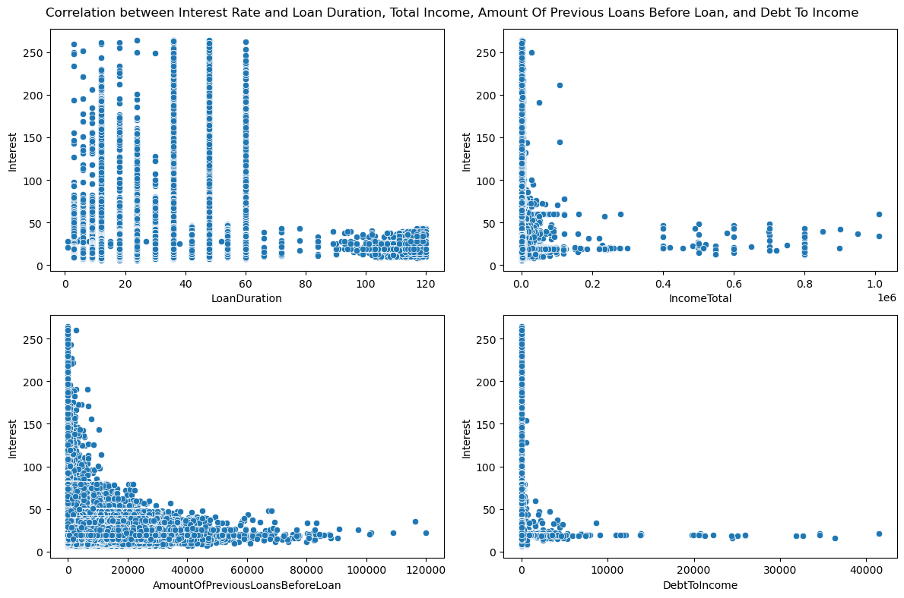

# 🏦 Loan Interest Rate Analysis - Python Statistical Project

A comprehensive machine learning project analyzing loan interest rates using the Bondora P2P Loans dataset to help fintech companies personalize loan offers.

## 📊 Key Visualizations

### Interest Rate Distribution by Education Level

*Box plot analysis showing how education levels impact loan interest rates*

### Correlation Analysis Dashboard

*Scatter plot matrix revealing relationships between key financial metrics and interest rates*

## 🎯 Key Findings
- Average interest rate: **27.29%** (±18.03% std dev)
- **10,543 borrowers** received less than their applied amount
- High-risk customers: **28.86%** vs low-risk: **26.99%** average interest
- Strongest predictor: **Amount of Previous Loans** (correlation: -0.175)

## 🔍 Statistical Insights
- **Education Impact**: Clear variation in interest rates across education levels
- **Previous Loans**: Negative correlation (-0.175) - more previous loans = lower rates
- **Income Effect**: Minimal correlation (-0.0122) with interest rates
- **Risk Segmentation**: 1.87% higher rates for high-risk customers
